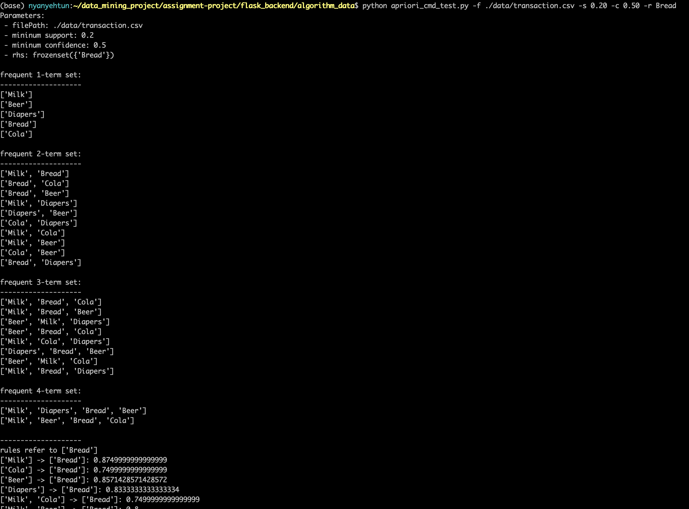

# data-mining-apriori Demonstration

## Flask Backend Setup 
Create virutal environment first but if virtualenv is not installed on your machine, try to install with following command.
```
pip install virtualenv
```
Go to flask_backend folder and create virtual environment using virtualenv and activate the environment:
```
cd flask_backend
virtualenv -p python3 venv
source venv/bin/activate
```
Intall dependencies inside requirements.txt:
```
pip install -r requirements.txt
```

Now you can start running the backend:
```
python app.py
```

## ReactJS frontend setup

### Note: Make sure you have install NodeJS, if not download here: https://nodejs.org/en/

Install dependencies from package.json
```
cd gatsby_frontend
npm i
```

Run frontend with following code:
```
npm start
```

### Note: Frontend run on port 8000 by default and backend run on port 5000 by default.


## Screenshots of working demo in web


# Usage with Terminal For Testing out Algorithm

Test out with the provided dataset in path (flask_backend/algorithm_data/data/transaction.csv), use the following command:
```
cd flask_backend/algorithm_data
python apriori_cmd_test.py -f ./data/transaction.csv -s 0.20 -c 0.50 -r Bread
```
### Screenshots of working demo in terminal

